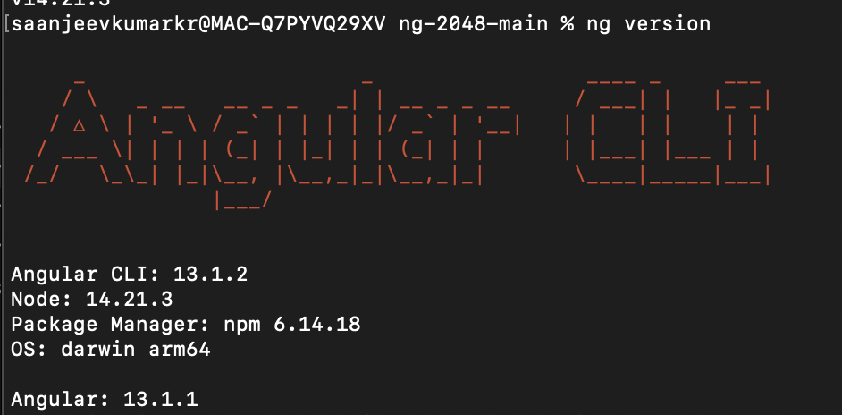

# ng-2048

## Demo

</a>

 

## About the game
A new rendition of the classic [2048 game] using Angular, Typescript, Tailwind CSS and a bit of 💗

## Version

 

## Try Locally

Clone the repository first. Then install the package dependencies using npm or yarn.

Then run `ng serve` for a dev server. Navigate to `http://localhost:4200/`. The app will automatically reload if you change any of the source files.

## About me
SaanjeevKumar KR
Give me shout out on my LinkedIn Page
LinkedIn: `https://www.linkedin.com/in/saanjeevkumar-k-r/`

